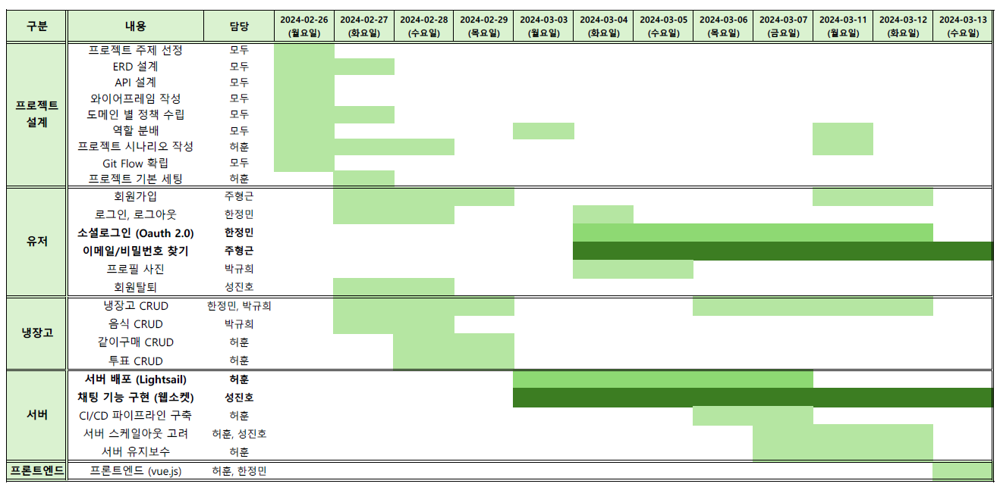

# 🧊 bingo-jango: 우리 집 냉장고를 관리해보자!

빙고장고(bingo-jango)실제 물리적으로 '같은 공간' (집, 셰어하우스 등)에 거주하며, '같은 냉장고'를 사용하는 인원 간에 다음과 같은 기능을 제공하는 웹 애플리케이션입니다.

 - 냉장고 내 공유되는 식품들의 종류, 수량, 유통기한 등을 관리

 - 수량이 부족한 식품에 대한 구매 여부를 냉장고 소속 인원들의 투표를 통해 결정

 - 구매 승인된 식품과 연계된 쇼핑몰 목록을 제공 및 최저가 상품 추천

## ⏰ Time Table...

## 👨‍👩‍👧‍👦 Built With...
|                             허훈                             |                            성진호                             |                            한정민                             |                            박규희                             |                            주형근                             |
|:----------------------------------------------------------:|:----------------------------------------------------------:|:----------------------------------------------------------:|:----------------------------------------------------------:|:----------------------------------------------------------:|
|  |  |  |  |  |
|          [@hunzzzzz](https://github.com/hunzzzzz)          |           [@WiGenie](https://github.com/WiGenie)           |         [@jeongminy](https://github.com/jeongminy)         |          [@qordpsem](https://github.com/qordpsem)          |         [@cresent10](https://github.com/cresent10)         |
|               `리더`, `같이구매, 투표 CRUD`, `서버 배포`               |                   `부리더` `회원 CRUD`, `채팅`                    |            `팀원` `냉장고 CRUD`, `인증 및 인가`, `소셜 로그인`            |               `팀원` `냉장고, 음식 CRUD`, `프로필 사진`                |             `팀원` `회원 CRUD`, `이메일 인증`, `휴대폰 인증`             |

## ⚒️ 개발 도구 및 환경

### 협업

### Back-End

### 서버 배포

